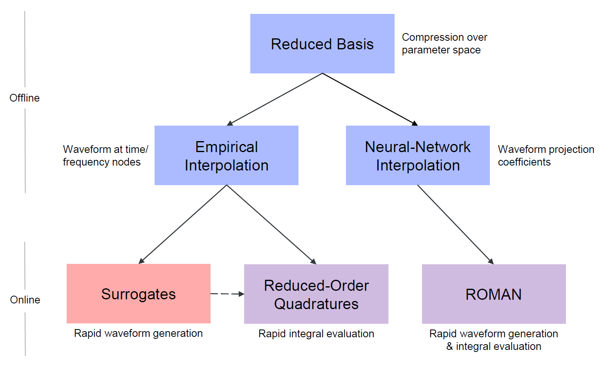
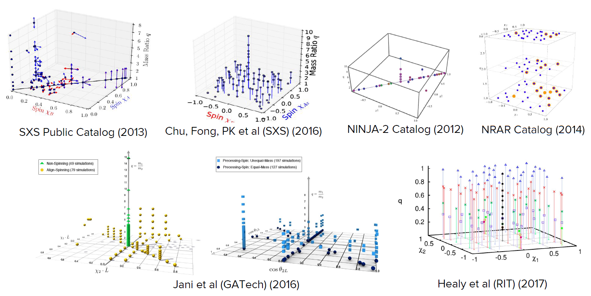
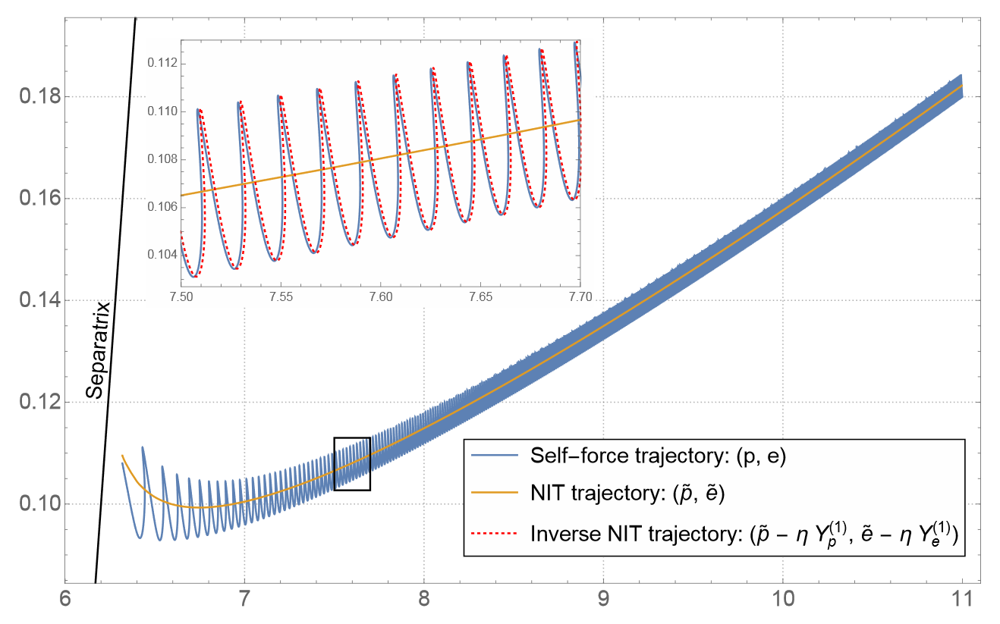
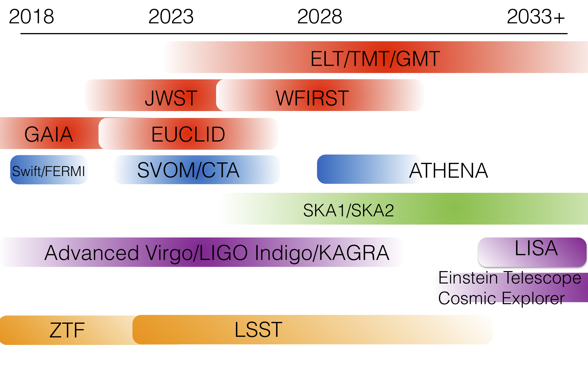
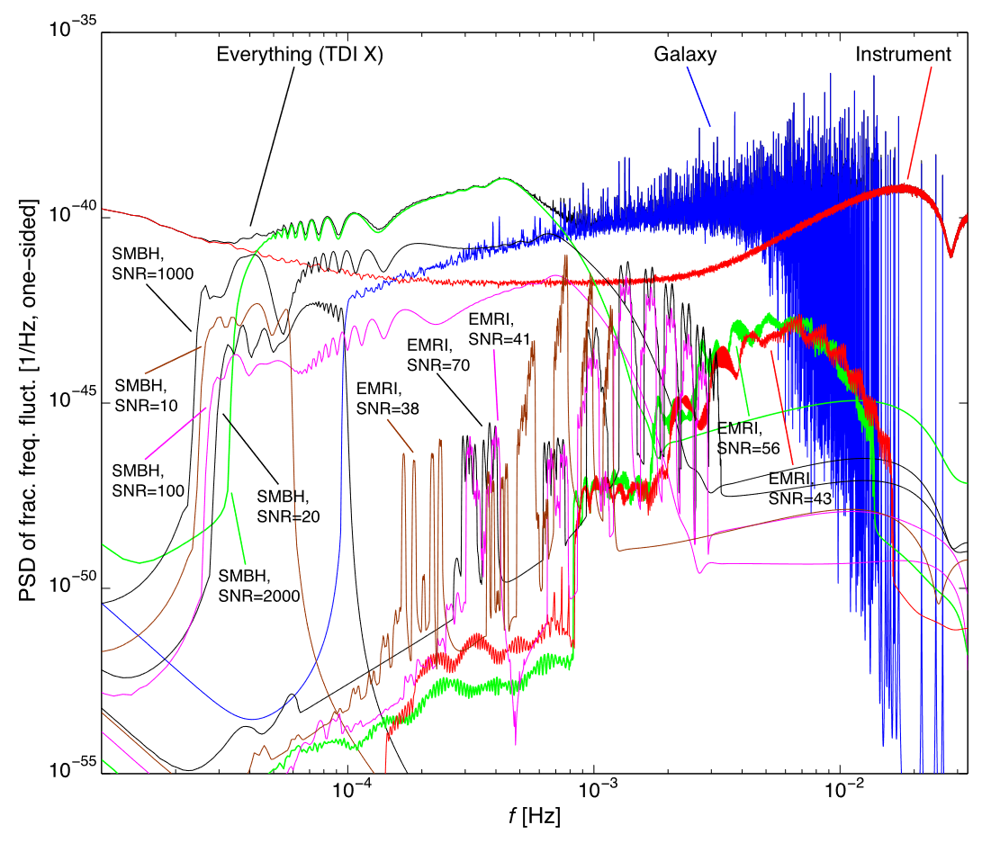
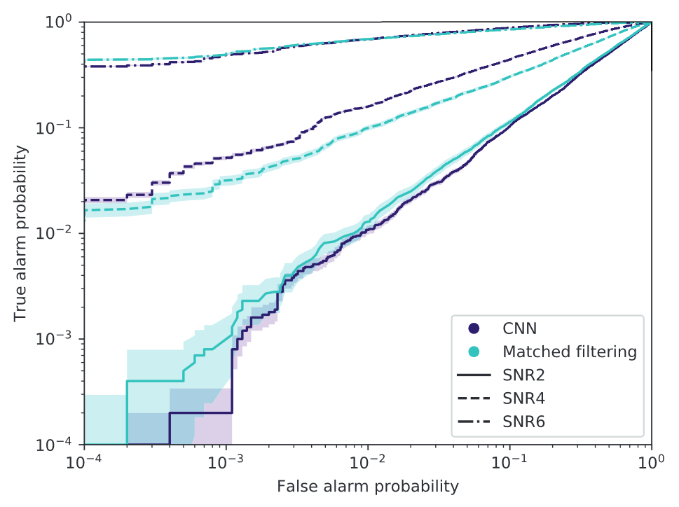

# The Architecture of the LISA Science Analysis

A Keck Institute for Space Studies workshop, January 16--19, 2018
**Final report**, January 2019 

* Rachel Akeson - California Institute of Technology
* Anne Archibald - Universiteit van Amsterdam
* Stanislav Babak - Université Paris Diderot
* Katelyn Breivik - Canadian Institute for Theoretical Astrophysics
* C. Titus Brown - University of California, Davis
* **Alvin Chua** (scientific secretary) - Jet Propulsion Laboratory
* Neil Cornish - Montana State University
* Curt Cutler - Jet Propulsion Laboratory
* Scott Davidoff - Jet Propulsion Laboratory
* Francois Foucart - University of New Hampshire
* Chad Galley - Jet Propulsion Laboratory
* Lawrence Kidder - Cornell University
* Prayush Kumar - Cornell University
* Astrid Lamberts - California Institute of Technology
* Geoffrey Lovelace - California State University, Fullerton
* Ashish Mahabal - California Institute of Technology
* Christine Corbett Moran - California Institute of Technology
* Laura Nuttall - University of Portsmouth
* Maria Okounkova - California Institute of Technology
* Travis Robson - Montana State University
* Mark Scheel - California Institute of Technology
* Deirdre Shoemaker - Georgia Institute of Technology
* Stephen Taylor - California Institute of Technology
* **Saul Teukolsky** (co-organizer) - California Institute of Technology
* Massimo Tinto - University of California, San Diego
* **Michele Vallisneri** (co-organizer) - Jet Propulsion Laboratory
* Vijay Varma - California Institute of Technology
* Alberto Vecchio - University of Birmingham

## Overview

### Our goals

The space-based gravitational-wave (*henceforth, GW!*) observatory **LISA** [@2017arXiv170200786A] will offer **unparalleled science returns**, including a view of massive black-hole mergers to high redshifts, precision tests of general relativity and black-hole structure, a census of thousands of compact binaries in the Galaxy, and the possibility of detecting stochastic signals from the early Universe. 

While the Mock LISA Data Challenges (2006--2011) gave us confidence that LISA will be able to fulfill its scientific potential, we still have a rather incomplete idea of what the **end-to-end LISA science analysis** should look like. The task at hand is substantial.

* Our data reduction needs to ensure the phase coherence of GW measurements across data gaps and instrument glitches over multiple years.
* Our waveform models need to reach part-in-$10^5$ accuracy to maximize the science payoff of the mission, with sufficient computational efficiency to sample parameter space broadly.
* Our algorithms need to resolve thousands of individual sources of different types and strengths, all of them superimposed in the same multi-year dataset, and simultaneously characterize the underlying noise-like stochastic background.
* Our catalogs need to represent the complex and high-dimensional joint distributions of estimated source parameters for all sources.

It is tempting to assume that current algorithms and prototype codes will scale up to this challenge, thanks to the greatly increased computational power that will become available by LISA's launch in the early 2030s. In reality, harnessing that power will require very different **methods, adapted to future high-performance computational architectures** that we can only glimpse now. Thus, we need to begin our exploration at this time, seeking inspiration from other disciplines (e.g., big-data processing, computational biology, the most advanced applications in astroinformatics), and learning to pose the same physical questions in different, future-proof ways—or even daring to imagine questions that will be tractable only with future machines. 

The broad objective of this study program was to imagine **how evolved or rethought data-analysis algorithms and source-modeling codes will solve the LISA science analysis on the computers of the future**, with the hope of guiding LISA science and data-analysis research and development in the years to come.

<!-- Omitting this text from the workshop presentation because we don't necessarily answer these very questions.

* Can we run numerical relativity simulations on massively parallel, loosely connected processors, in a fault tolerant way?
* Can we break away from the serial nature of stochastic parameter estimation to (again) exploit parallelism?
* Can we apply "divide and conquer" principles to the extremely interconnected LISA "global fit"?
* What representation can we give for the entries (which range from very fuzzy to very defined) in evolving source catalogs, so that we can support the production of partially cleaned datasets, and allow the interaction of multiple analysts? -->

### Our study

The study began with a short course open to the Caltech community, with video available online [@kisscourses], with sections on LISA science (by Curt Cutler), the numerical modeling of LISA sources (by Deirdre Shoemaker), and LISA data analysis (by Stas Babak).

The study participants then convened for three sessions consisting of tutorials, discussions, and breakout groups:

* The session on **data-analysis problems and approaches** included talks on stochastic techniques, machine/deep learning, the LISA Data Processing Center being prototyped in Paris, modern astronomical archives, as well as a panel on social aspects of writing scientific software. Breakout groups convened to discuss the global-fit problem, data products, and the detection of unexpected signals. 

* The session on **numerical modeling** included talks on new computational paradigms, parameter estimation, hydrodynamics in numerical relativity, and reduced-order-modeling waveforms, as well as a panel on EMRI waveforms, which are especially challenging analytically and numerically. Breakout groups convened to discuss new ideas for waveform-accuracy estimates, searches and parameter estimation, and the astronomy-community interface.

* The session on **computation** included talks on data-intensive architectures, the scientific use of GPUs, "live" data products, and advanced visualization techniques. 
    
The study participants then discussed follow up work and the organization of report-writing. Slides from all presentations are available on the KISS website [@kisspresentations].

### This report

This report does not aim at providing an exhaustive retelling of the many interesting discussions that took place at the study; rather, it focuses on the *stories and questions* that we consider likely to generate the most interesting and urgent directions of research.

The report includes three main sections. The **complexity and richness of LISA science** covers the requirements of efficiency and accuracy imposed on waveforms by LISA's remarkable sensitivity, as well as the many use astronomical cases for the LISA data, which will need to be fulfilled with *ad hoc* data products. **Hard problems** focuses on the difficulty of detecting and characterizing many thousands of superimposed sources; of compiling and serving a source catalog that can fully represent the LISA findings and enable insightful science; and of building confidence in the detection of previously unknown sources that inhabit LISA's proverbial *discovery space*. **New tools** is concerned with the mostly untapped power of deep learning for GW analysis applications, and with emerging tools (such as computational notebooks) that promise agile, efficient, and reproducible access to astronomical archives and to all computations that can be performed with them.   

An executive summary, such as would be customary for a report such as this, could not do justice to the explorational nature of this study, and to the many strands that we touched briefly and that yet may figure in the ultimate solution to the LISA science analysis. We offer instead an **unordered list of takeaways** that one of us (M.V.) compiled shortly after the study. As you will see, some of these points are represented more generously than others in the rest of this report, so if you do read through, you will come out with your own different list. Nevertheless:

* There are many very deep research questions that stand between us and the solution to the LISA science analysis. It will take time to answer then, and we will need to think carefully and purposefully about them. However, since we need to get going practically, we can begin by **providing infrastructure for experimentation that will later become infrastructure for implementation**. We should be especially careful to remain flexible while we get oriented.

* As for numerical modelers, they need **practical performance and accuracy benchmarks** as soon as possible, so that they can strategize on making LISA-grade waveforms across all source classes. As Saul Teukolsky points out, "This is a billion dollar experiment, and we do not want to sacrifice even the last vestiges of science that can be extracted from it."

* The awe-inducing demonstrations of **deep learning** (DL!) in many domains (and the first tentative applications in GW data analysis) show the potential of this technique, which will only become more important because it is already driving processor development; so our wish to continue riding Moore's law will only be fulfilled if we embrace DL as a data-analysis workhorse, or at least if we recast standard calculations in DL's mathematical language.

* Speaking of Moore's law, much of its ascent in recent times has come in the shape of ever more powerful graphical processing units, with larger and larger collections of elementary compute cores. **GPU programming** used to be a perilous and abstruse land, but thankfully now the right tools (especially compilers, mathematical libraries) are now available to wield all the Gigaflops we are promised.

* We need to **look outside the GW community** and provide diverse venues for engagement of scientists of different kinds who will make the most of the LISA data, and of untapped talent more generally. We can take advantage of "citizen" programmers, but we need virtuous policies and modern practices in organizing scientific software development and in distributing credit fairly.
    
* The high-level LISA data products will need to serve a diverse community ranging from cosmographers to population modelers, from seekers of counterparts to experts in alternative theories of gravity. We can take inspiration from recent astronomical archives (Fermi, Kepler, SDSS) in **tailoring and diversifying our data products**. However, we should remember that the best internal data representation (for source characterization, data cleaning, and to handle the continuous influx of data) may not be same as needed for archiving and for external users. We need help from database professionals.
    
* There are now powerful **collaborative tools that are fulfilling a vision of open science** and of computations brought to otherwise unwieldy datasets *in the cloud*. In addition, bespoke visualizations can be extremely insightful. While LISA will fly with onboard technology that is necessarily frozen at the beginning of its arc,[^atleast] the same need not be true for its science segment, if we remain flexible and observant.

[^atleast]: At least for hardware; it would be great to be able to perform small updates to software if big improvements are possible.

## The complexity and richness of LISA science

### LISA needs waveforms!

In discussing **waveform accuracy**, it is useful to distinguish between the intrinsic error in the underlying *models* of physics [@10.1017/CBO9781139583961.009] [@10.1017/CBO9781139583961.011] (e.g., a numerical relativity simulation, or a post-Newtonian expansion of Einstein's field equations) and the error incurred in making these models available as *templates*: *hybridization* error when marrying analytical and numerical waveforms; *approximation* error when fitting phenomenological models to simulations; *representation* error when casting waveforms on reduced-order-modeling bases. (One speaks generally of *surrogates* to encompass waveforms that can be evaluated efficiently and that approximate more careful and expensive computations.)

Physical-model errors are addressed by theoretical work; template errors by more careful and potentially costly computation. **Waveform accuracy requirements affect both the theoretical inputs and their data-analytic representations**, and they will depend strongly on the data-analysis *application* under consideration. A roughly accuracy-ranked list of applications (with the most demanding on top) would be

1. testing general relativity;
2. astrophysical parameter estimation;
3. minimizing residuals after the hierarchical subtraction of loud signals;
4. detection (which will be certainly satisfied when 2 and 3 are)

We should target the application with the most stringent needs. However, how do we define **waveform accuracy requirements** formally for LISA? It is unclear that we have all the mathematical tools and criteria to pose this question profitably (although we have well-established foundations [@10.1103/PhysRevD.78.124020] [^accuracy]). 
In space-project jargon, **what is the modeling and templating error budget for LISA?** Once we know, we can ask questions such as:

[^accuracy]: A sufficient condition for the systematic error from mismodeling to be negligible compared to the random effects of noise is for the *mismatch* to be smaller than $D/(2 \, \mathrm{SNR}^2)$, where $D$ is the number of parameters in the waveform. See [@Chatziioannou:2016ezg].

* Are post-Newtonian (PN), effective-one-body (EOB), and numerical-relativistic (NR) binary models sufficiently accurate to extract all science from loud massive black-hole binary inspirals? E.g, are numerical-relativity simulations sufficient to capture the fine details of mergers? How *long* do they need so that the "handoff" from PN/EOB to numerical is sufficiently accurate?
* What about the model representations as phenomenological (*Phenom*) or reduced-order-modeling (ROM) templates? Can these be improved at the cost of more computation, whether *online* during parameter estimation or in a preliminary stage?

The other important consideration is that we should concentrate on the specific **region of source parameter space to which LISA will be sensitive**: for instance, significant binary eccentricity and precession are challenging to numerical simulations, and they will be more relevant to LISA than they are to ground-based detections.

In terms of work that is happening within the LISA Consortium as we write, it is relevant to ask if the **LISA Data Challenges** (LDC) [@ldc] could be used to answer these questions empirically. (However, the template families used currently in the LDC need to be updated toward the state of the art.) Specifically, we would address the level of waveform error that is tolerable for different parameter-estimation tasks.
To do so, we need to designate a waveform family *as truth*, then perform parameter estimation with a different family.

For instance, if the reference waveforms are provided by long(er) numerical-relativity simulations and parameter estimation is performed with *Phenom* surrogates, we would be testing the accuracy of the *Phenom* template implementation (which can also be done directly [@10.1103/PhysRevD.93.104050]). Conversely, we can use a surrogate family as reference and perform parameter estimation with a modified surrogate that includes *plausible* phasing/amplitude errors across parameter space (e.g., as obtained by comparing numerical-grid refinements): doing so would exemplify the parameter-estimation consequences of mismodeling error and potentially lead to quantitative accuracy criteria for models. In doing such tests, we would:

* where possible, seed numerical investigations with analytical results, such as Cutler and Vallisneri's analysis of parameter-estimation bias [@10.1103/PhysRevD.76.104018], formulated for PN waveforms; 
* make sure the analysis is sufficiently general---we should be able to apply the same methods to all waveform families using compatible definitions of intrinsic errors;
* perform the study up to the highest expected signal-to-noise ratios (for binary black-hole coalescences, $10^4$).

Once accuracy requirements are understood, the modeling community can set out to fulfill them. In the case of **numerical relativity**, it is unclear that current paradigms (e.g., domain-based parallelism) will suffice, even when coupled with the continued growth of computing power. Indeed, the movement toward sharing power among many compute cores raises many problems that limit performance: communication bandwidth and latency, memory contention, synchronization bottlenecks.

Recent efforts to reformulate the numerical solution of Einstein's equation in terms of **task-based parallelism** [@10.1016/j.jcp.2016.12.059] aim to address these limits, dividing computation into tasks within a dependency tree. The tasks correspond (roughly) to evaluating the functions required to advance the evolution equations; the parameters needed by the functions define their mutual dependencies. A smart scheduler assigns tasks that are ready to compute cores, managing asynchronous information transfer, and (crucially) handling load balancing and *task stealing*.
<!-- Would be good to have something to say about performance. -->

It may be possible to improve the *status quo* for other aspects of NR modeling; for instance, by applying machine learning to automation in the "hand holding" of simulation runs, and possibly replacing certain computational bottlenecks with appropriately trained neural networks (an approach used in particle physics for expensive Monte Carlo likelihoods).

We would hope that the eventual modeling and representation errors would be so small that they can simply be ignored in data analysis. If this is not the case, we must formulate a robust method to propagate a characterization of the errors into data-analysis pipelines, where the corresponding degrees of freedom can be treated as nuisance parameters and marginalized over [@10.1103/PhysRevD.93.064001].

<!-- [@10.1088/1361-6382/aac8ce] not allowed in figure environment -->

Beyond the general schemes outlined above, there are specific considerations to be made for each class of LISA sources. For **massive and stellar-mass black-hole binaries with comparable mass ratios**, we already have banks of numerical-relativity simulations that can provide fiducial injections, although we need more simulations of eccentric binaries; PN waveforms also need to include eccentricity organically. To orient effort in both domains, we need to understand astrophysical expectations for eccentric systems. NR simulations are currently able to comfortably handle eccentricity and spin precession, for mass ratios of up to around 1/20 and spin magnitudes of up to around 0.8. An extension to higher spins would require improved initial data, while going to more pronounced mass ratios will likely be better achieved through black-hole perturbation theory.

**Intermediate--mass-ratio black-hole binaries** (IMRIs) are very problematic already at the modeling stage. They would require pushing perturbative analytical expansions to third order in the mass ratio -- very difficult -- although Le Tiec's "$q$ to $\nu$" trick may help [@10.1103/PhysRevD.88.124027]. At worst, we may need to investigate new perturbative schemes for the selfforce. Looking at currently available models and simulations, we could test EOB waveforms at high mass ratio with numerical-relativity runs, which however would be very expensive.

The modeling of **extreme--mass-ratio inspirals** (EMRIs) for parameter estimation requires up to second-order self-force corrections to a Kerr geodesic orbit, or specifically their average dissipative effects. (The complete second-order contribution would be useful for IMRIs.) Waveforms produced directly from self-force calculations would be too computationally expensive for use in parameter estimation algorithms, and must be approximated by a surrogate with very minimal loss of accuracy. The fast near-identity-transform method of van de Meent and Warburton [@10.1088/1361-6382/aac8ce] is promising for this purpose, although it depends on the construction of an accurate interpolant for the self-force when the calculations become available. For EMRI detection, fast **kludge waveforms** [@10.1103/PhysRevD.69.082005] [@10.1103/PhysRevD.75.024005] [@10.1088/0264-9381/32/23/232002] that utilize various approximations have been shown to be adequate [@10.1103/PhysRevD.96.044005], but the presently available ones should still be improved further in terms of both their speed and accuracy.

### LISA hearts astronomy

The LISA observations will seed many studies, investigations, and followups across the astronomical community. Because the LISA archive will be the first of its kind (notwithstanding many similarities with source catalogs for mature ground-based GW detectors) it is important to **reach out to astronomers** to teach them the peculiarities of LISA data, and to learn about their requirements and use cases. KISS study participants outlined several avenues to do so, including holding regular workshops at professional conferences; providing worked-out data-analysis examples (e.g., as computational notebooks, see below); structuring the LISA archive to accept contributions from outside the project. 
This outreach could extend to the public, through a carefully designed *citizen science project* similar to Gravity Spy [@gravityspy].

Thus, the LISA data archive will need to fulfill **many different use cases** in the astronomical community. The following are five examples (certainly not exhaustive) which we chose to probe the range of possible data products, and their connections to other astronomical catalogs.

* **A census of massive black holes throughout the Universe.** LISA will observe massive black-hole mergers (MBHs) throughout the entire history of the Universe, and EMRI events out to $z\sim 1$. With several tens of events per year and a mission length in the range 5--10 years, LISA will build up a catalog of potentially hundreds of these events that can be used to form a census of MBH properties over cosmic time. In particular, LISA will be sensitive to MBH mergers with constituent BHs in the range $10^4$--$10^7 M_\odot$, which will still harbor a signature of seed formation at high redshifts. This catalog will also shed light on the impact of metallicity on MBH formation, MBH accretion efficiencies, and MBH accretion geometries. Models of hierarchical structure formation that have been constructed for consistency with observed AGN properties can agree with a wide variety of BH seed conditions [@10.1103/PhysRevD.81.104014],[@10.1088/0264-9381/28/9/094018],[@10.1103/PhysRevD.83.044036]. Hence, LISA offers an unparalleled opportunity to peer into seed formation and accretion models of BHs across throughout the history of the Universe.
**Required data products**: Catalog of events, with independent posterior samples for each. The recovered event parameters should include luminosity distance, component spins, and component masses. 

* **Mapping Galactic structure and formation using white-dwarf binaries.** The population of white dwarfs (WDs) residing in the Milky Way is an important tracer of the Galactic gravitational potential and formation history [@10.1038/nature11062].  While the most interesting probes into Galactic structure and evolution history reside with the distant populations in the Milky Way halo, Gaia will observe the WD population with 100% completeness out to only 100 pc [@10.1051/0004-6361/201220596]. This is largely due to the combined restrictions leading from Gaia's limiting magnitude (20) and the inherent dim nature of WDs. Studies have shown, however, that LISA will observe gravitational waves from hundreds to thousands of resolved double WDs (DWDs) in the outer regions of the Galaxy with high signal to noise. Included in this large population is the subset of several dozens of detached and accreting DWDs observable by *both* LISA and Gaia [@10.1093/mnras/stx1285],[@10.3847/1538-4357/aa8557].  The combined observations of WDs from Gaia in the regions out to 100 pc and LISA in the regions beyond could provide an unprecedented view into the structure and formation of the Milky Way.
**Required data products**: Catalog of parameters of resolved WDs, including three dimensional positions and masses.

* **Understanding unknown GW signals.** Although there are a number of sources LISA will definitely observe (such as massive black hole mergers and white dwarf binaries), the mission may also discover completely unexpected signals. (See also the section dedicated to such detections in *Hard problems* below.) In order to rule out instrumental origins there will have to be a standard (and if possible) automated checklist of investigations to conduct, such as checking the time delay between the excitations felt at each spacecraft, as well as auxiliary sensors data. Furthermore, Robson and colleagues [@Robson:2018jly] showed that the difference in phasing for glitches and signals in the LISA observables may allow us to distinguish unmodeled GW bursts from instrument glitches. Once an astrophysical origin can be established, as much information as possible concerning the unknown signal will need to be appear in the LISA catalog, for follow-up study and comparisons with electromagnetic catalogs. This is a exciting opportunity for scientists across many disciplines to work together to understand a new source of GWs. Lessons on how to investigate this form of signal can certainly be learnt from other areas of astrophysics, such as fast radio bursts.
**Required data products**: Strain data containing the signal; as much information about the signal as possible, such as sky localization, length of the signal, peak strain amplitude, etc. 

* **Episodic accretion in  white dwarf binary populations.** Cataclysmic variables (CVs) and AM Canum Venaticorum stars (AM CVn) will comprise a large subset of the resolved compact binaries observed by LISA in the Milky Way [@2005ASPC] [@10.1063/1.3527826]. Based on EM observations, several of these systems (*verification binaries*) are known to emit GWs detectable by LISA [@10.1111/j.1745-3933.2009.00754.x]. Observing AM CVns in outburst leads to a wide range of opportunities to witness astrophysical processes of great interest, including accretion disk spiral density waves, quasi-period oscillations, and the launching of jets [@10.1093/mnras/290.2.L28] [@10.1086/319826] [@10.1051/0004-6361/201425482] [@10.1093/mnras/stw2133]. AM CVn outbursts have been shown to have orbital-period--dependent brightness variations, recurrence times, and durations, with shorter orbital periods leading to smaller brightness variations and shorter durations and recurrence times [@10.1093/mnras/stu2105]. While duration times are 10--40 days over orbital periods of 22--36 mins, the recurrence times are 30--500 days over the same orbital period range, highlighting the necessity for rapid release of GW data from accreting WD binaries.
**Required data products**: Catalog of parameters for accreting WDs, especially mass, chirps, and positions, made available *on timescales of days to weeks*.

* **Multi-messenger observations of massive black hole mergers.** Combined detections of the GW and EM signals powered by merging MBH binaries can significantly enhance the scientific return of LISA. EM signals provide improved localization and distance estimates, as well as information about the environment of the merging MBHs, thus opening new ways to use LISA detections in cosmology, astrophysics, and for tests of general relativity. Given the large uncertainties in the sky localization of LISA events, this will only be possible if the EM signals are sufficiently well understood to limit the rate of false positives in the LISA detection volume. The most promising EM counterparts to merging MBHs are powered by the accretion of gas onto the MBHs, both before and after merger. Our theoretical understanding of that process remains limited, in part due to the difficulty involved in simulating the many different time scales relevant to this problem, and in part due to large uncertainties regarding the feeding mechanism of MBH binaries and the large scale structure of the accretion flow.
**Required data products**: Prompt alerts provided by LISA to EM observers, with tight sky localization.

Archives are a crucial part of astronomy! They preserve data gathered with tremendous expense of treasure and talent, and they enable impactful archival science long after the end of a mission or survey. Study participant Rachel Akeson emphasized that easily searchable archival datasets facilitate innovative uses, especially where databases combine information from multiple missions and facilities. [@ned] Archives contain:

* **Raw and processed data from a mission**. For LISA, data products have been tentatively assigned to four levels---0: raw interferometric measurements and auxiliary data; 1: time-delay-interferometry observables (TDI, the closest LISA comes to GW strain) and data-quality indicators; 2: individual-source parameter estimates and partially source-subtracted observables; 3: full catalogs. Transient event alerts (e.g., for imminent massive black-hole mergers) would fall between 2 and 3.
* **Other mission data**, such as spacecraft data that may not seem immediately relevant, [^spitzer] metadata characterizing pipeline output for completeness, reliability, or simulated data of various kinds.
* **High-level derived products and associations from the archive**. For LISA, premiere products would include cross-identifications with EM objects from other missions and observatories.
* **High-level data products from the community**. For LISA, reanalyses of individual sources or revisitings of the global solution, as well as independent associations with other databases, for which good interfaces will be crucial. Standardization and reliability of community inputs is often an issue.

[^spitzer]: For instance, Spitzer developed an exoplanet transit mode eight years after launch, using pointing data not originally used in processing pipeline. See [@Beichman2017]

The level of archive support varies greatly, and for large space missions it normally includes dedicated user interfaces, bespoke tools and visualization, and helpdesk support. Datasets can be updated continuously or episodically, when costly or delicate processing is needed. While astronomy is not (or not yet) "Big Data" by Silicon Valley standards, volume still poses issues for retrieval, searching, and processing. The standard mantra is now *bring the computation to the data*, with the usual qualifier *in the cloud*. Akeson emphasized **careful planning and organization** early on, especially for large datasets that will then be hard to move and change, or for capabilities that may be precluded by cost if pursued later. She praised task-specific optimization and reduction of overheads, and warned against complexity, since "things that are complicated when they are small explode on you when they grow big."

Ultimately, the design of the LISA archive will reflect the peculiarities of a space-based GW observatory (see "Designing the LISA catalog" below) and the use cases collected from the astronomical community. Nevertheless, it should reuse established solutions where available, and it can benefit from the experience (with regards to serving the scientific community and to engaging *citizen scientists*) of ground-based detectors and of survey space missions such as Fermi and Kepler.

The **LIGO--Virgo Collaboration** currently releases prompt event alerts, limited data stretches (4,096 s) around events published in refereed journals, and full strain datasets two years after the end of an observing run (although this delay may be shortened in the future). The **Gravitational Wave Open Science Center** [@losc] (formerly LIGO Open Science Center) hosts public datasets along with tutorials and tools to aid data use.
It recently released the first *catalog of detected GW transients* [@2018arXiv181112907T] [@10.7935/82H3-HH23], as well as *posterior samples* for selected events.  Some lessons applicable to LISA are that:

* we should carefully consider the content and format of data products ahead of time (and possibly release mock examples), so that future users have time to prepare downstream tools;
* we should think carefully about giving guidance about the interpretation of the data. In the case of LIGO--Virgo, strain-data releases were never meant to allow the reproduction of GW searches, but were nevertheless used in that way, resulting in almost certainly spurious claims. [@10.1088/1475-7516/2017/08/013]

NASA's **Fermi** [@fermi] is a sky-scanning telescope with public data (*photons*!) and software. Photons are posted as they are detected, but then are revised with much better characterization in successive data releases. These releases include updated calibration data and software tools. In addition, Fermi publishes catalogs describing confirmed point sources with spectral model fits, plus a few diffuse sources. Typical users who wish to study a source use all "nearby" photons together with calibration and catalogs, and perform a **multisource spectral fit** (with a Fermi-provided tool) to account for the possibility that each photon may come from the target, or from the wings of the point spread function of other nearby sources. This kind of entanglement has obvious parallels to LISA's confusion problem.

* One lesson is that even simple tasks, such as computing light curves, require **reprocessing mission data with sophisticated mission-provided software**. Furthermore, users need to exploit higher-level products (the catalogs) to make sense of lower-level ones (the photons). This will definitely be the case for certain LISA investigations, such as tests of general relativity on loud massive black-hole inspirals, where fine waveform detail will be correlated with the parameters of other overlapping signals.
* For LISA, a (figurative) **spectrum of increasingly informative catalogs** may address such correlation problems. Some users would be happy with a basic catalog listing maximum-likelihood source parameters plus uncertainties, for sources that pass some quantitative false-alarm criterion. At the next level, sources could list parameter correlations in multivariate normal form. Next, catalog entries could list substantial correlations with other sources, which may be shaky for the weakest signals. Finally, more elaborate single-source and joint posteriors would be specified wherever useful, or possibly on the basis of user requests.

NASA's **Kepler** [@kepler] employed the *transit method* to survey our Galactic neighborhood and discover hundreds of Earth-size and smaller planets in or near the habitable zone, characterizing the fraction of stars that might have such planets. The statistical nature of Kepler's goals, its increase in sensitivity with longer baselines, and its resurrection in a different operating mode after a hardware failure resulted in **multiple versions and multiple kinds** of astronomical data products and catalogs [@keplerdata] covering many different use cases. Some lessons applicable to LISA are that:

* the astronomical community can deal with multiple purposes of object catalogs; with iterative catalog versions; and with objects changing status between catalogs (or even appearing and disappearing)---but consistent versioning is paramount;
* the full range of products should be defined early to allow for good interfaces and dataflow in processing and archive;
* project definitions and thresholds should be enforced strictly to avoid confusion (e.g., we should avoid changes in SNR thresholds or object status definitions between groups in project).

## Hard problems

### The global fit

It was realized early [@AMIGOS2005] in the development of the LISA mission that the problem of combining the identification and characterization of thousands of individual sources would be a difficult one, especially in the presence of data gaps and artifacts, or of poorly measured, nonstationary/non-Gaussian noise.

**Many reasons for worry.** The "confusion" problem in LISA data analysis lies in the fact that multiple signals (if *overlapping* geometrically in signal space) interact in the likelihood. Typical overlaps are small, but small groups of sources will be in close proximity, and be poorly resolvable. Furthermore, with many signals the confusion adds up and unresolved signals (including many millions of Galactic binaries) act as an effective non-Gaussian and nonstationary noise term. [@10.1103/PhysRevD.73.042001] [@10.1088/1361-6382/aa9601]

Furthermore, even the number of sources is unknown; this calls for *transdimensional* likelihood exploration algorithms, where goodness of fit (which will always increase with the number of model parameters) is tempered by a regularization term (which happens naturally in a Bayesian framework [laumann2018]), or ideally by a strong astrophysical prior. 

The basic building block of GW analysis is the likelihood/sampling distribution of instrument noise, which is evaluated most efficiently in a diagonal basis. For stationary Gaussian noise, the frequency domain provides such a representation. However LISA instrument noise will be nonstationary because of instrument effects, and also because of the "seasonal" confusion background from the Galaxy.

<!-- not allowed in caption [@10.1088/0264-9381/24/19/S18] -->

**Exploiting randomness.** Stochastic methods such as Markov-Chain Monte Carlo (MCMC) [@10.1146/annurev-astro-082214-122339] have long been a workhorse in GW analysis. Applying them to specific families of GW signals is more in the realm of art (or at least craft) than science. The choice of efficient proposals that provide a reliable guide for stochastic exploration. In addition to the basic strategy of local posterior approximation with Fisher-matrix covariance, GW work has successfully employed *ad hoc* steps based on physical symmetries (e.g., jumps between multiple EMRI harmonics), precomputed (and necessarily approximated) global likelihood maps (e.g., an *F*-statistic map for global binaries), *differential evolution* (i.e., using past stochastic history to suggest jumps), and more. Approaches that improve on the basic Metropolis--Hastings exploration algorithm include *parallel tempering* [@10.1103/PhysRevLett.57.2607],[@10.1093/mnras/stv2422], Hamiltonian Monte Carlo [@neal2011mcmc], several variants of nested sampling, and more. Other GW-specific tricks involve the analytical maximization or marginalization of the likelihood, whenever possible.

**Glimpses of solutions.** Cornish suggests that a wavelet representation similar to what used by LIGO's WaveBurst may allow the efficient representation of slowly varying nonstationary noise, [@10.1214/aos/1034276620] [@nason2000wavelet] as well as an expedient treatment of gaps. Such a technique creates a need for efficient waveform generation in the wavelet domain.

In the LIGO context, *BayesWave* [@10.1088/0264-9381/32/13/135012] represents a sophisticated and efficient approach to modeling signals, instrument glitches, and noise out of basic components (wavelets for signals and glitches) assembled in trans-dimensional fashion. Its approach to signal and noise priors is pragmatic rather than fundamental (what "true" prior probability can after all be assigned to a given wavelet?), and it is validated by the standard strategy of injecting and recovering simulated signals in actual and synthesized instrument noise.

To tackle the LISA global-fit problem, Cornish suggests a strategy of "solving for anything", using a Bayesian model with dimension $\sim$ 500,000, possibly updating sources and parameters in turn. A smaller-scale application of this approach successfully resolved tens of thousands Galactic binaries, and was demonstrated in the first round of Mock LISA Data Challenges. [@Crowder:2006eu] The problem can be parallelized by creating many equivalent chains simultaneously (although each will need to deal with all parameters), or many temperatures in a *parallel-tempering* sampler.

After surveying this landscape, study participants identified a list of **key needs and challenges**:

* **Waveform overlaps** need to be quantified extensively, both between different waveform families, and between different parameter regions for the same type of waveforms (e.g., for EMRIs, which have very complex waveforms with multiple harmonics that may lead to partial "matches" between distant regions of parameter space).
* Priors for the **number of detectable sources** are poorly known; too strong assumptions may bias astrophysical inference from catalogs down the line.
* Extreme efficiency will be needed in **generating waveforms** *and* in producing the corresponding **LISA responses** (not a trivial operation for LISA).
* Bias from systematic/**unmodeled effects** (e.g., white-dwarf triples [@10.1103/PhysRevD.98.064012]) needs to be excluded or addressed. Likewise, instrument glitches will need to be recognized, then fit or excised.
* The **implementation** of the global fit is still defined very vaguely, and it is likely to be challenging technically. Issues to be clarified include:
	* Computational **parallelism**, which may be based on tasks, or populations, or source classes. Can we have multiple pipelines that fit different clusters of "similar" signals?
	* The logistics of **iterative exploration** (possibly proceeding from the strongest to the weakest sources). If iteration proceeds by subtracting progressively weaker signals, then the imperfect fit of the louder signals may leave significant residuals that confuse the fit of the weaker signals.
	* The **representation of very highly dimensional posteriors**.
* The global-fit solution will **evolve with time**: it will become better defined but more complex as we accrete more and more data, with subthreshold events transitioning into detectability.
* The quality of data and prevalence of noise will also vary naturally across time. Should our analysis proceed from the quietest times?
* How do we **evaluate and visualize** the **performance** (and correctness!) of likelihood exploration? (E.g., how do we know that we are exploring all relevant modes?)

Beyond these well-specified areas of investigations, study participants brainstormed several more open **ideas to explore**:

* Are there any **new methods** that could be applied to the problem of finding global maxima in high-dimensional search problems?
	* Is MCMC truly the only appropriate paradigm?
	* Are there alternatives to reversible-jump MCMC to handle transdimensionality?
	* Study participants mentioned the Hilbert--Huang transform, empirical mode decomposition, intrinsic time-scale decomposition.
* Could we use subsets of data to **soften likelihood surfaces** and subsets of parameters to reduce the dimensionality of the problem? (E.g., with only a week of data all binaries would be well-described by two parameters.) These fits/posteriors can then be evolved incrementally into more complete and complex ones. 
* It may be possible to take sub-threshold EMRI fits on short data spans and use **pattern recognition** to assemble them into a consistent EMRI solution.
* Can **machine learning** help with the parallel allocation of stochastic chains (possibly for subsets of sources)? Likewise, can we use machine learning to tune other search parameters?
* How can we **accelerate likelihood evaluations** (e.g., with GPUs, *tensor processing units*, precomputation/reuse of computation) and where can we usefully approximate them?
* Can we **fit confusion backgrounds of subthreshold sources**? (E.g., EMRIs, by somewhat keying on their distinctive features?)

<!-- Not including because I don't fully understand this:

* Finally, the following pseudocode represents the study participants' consensus for a **tentative global-fit algorithm**:

		1. Iteratively pick off biggest sources down to some threshold.
		2. Perform a global fit using for the strong sources we have identified, then subtract them from data.
		3. Fit N additional sources, each one independently on a different compute node, with occasional communication between nodes (for likelihood adjustments). N can be initialized empirically and updated, or treated à la reversible-jump MCMC. -->

### Designing the LISA catalog

When Hogg and Lang state forcefully that "Telescopes don't make catalogs" [@2010EAS] they mean that the direct output of telescopes are images (arrays of pixels), whereas the desired scientific outcome of observations and surveys is *statistical inference* about astrophysical properties or astronomical populations.  Standard catalogs, which typically describe best-fit parameters and error bars for all detected sources, are neither; they represent a historically entrenched intermediate data product, which may nevertheless diminish science payoffs if information is lost in compiling them.

There are several reasons to believe that a "traditional" LISA catalog may suffer mightily from this problem:

* **Source parameter correlations.** Most of LISA's sources are long-lived (radiating GWs in LISA's detection band for years or more), so tens of thousands of them will be present simultaneously in the LISA time series, and will need to be disentangled. If two detectable sources have strong overlap *in signal space*, then the parameter errors for one will be strongly correlated with the parameter errors of the other. Such correlations would need to be represented in the LISA catalog. As discussed above, even the *number* of sources may be uncertain: e.g., three WD--WD binaries with similar sky positions and frequencies may be fit reasonably well by a set of two binaries. It is not obvious how such alternative explanations of the data may even be represented in a catalog.
That such things will occur is to some extent an unavoidable fact of this mission, and the catalog must be designed with this in mind.  Understanding the extent of these sorts of "overlaps" will surely be important to designing a useful catalog. Hints of understanding appeared in the literature (e.g., Cutler and Racine [@10.1103/PhysRevD.76.124033] use large-deviation theory to show that it is extremely improbable that a large number of low-SNR WD binaries could mimic either an EMRI signal or MBHB signal), but much remains murky.
* **Quasi-detections.** The catalog should include a list of sub-threshold sources that come near the statistical threshold of confident detection, as well as preliminary estimates of their parameters (and possibly estimates of when the detector threshold would be reached, for the purpose of possible EM follow up).[^wise] Such sources contain significant information for astrophysical rate and population studies; furthermore, they play an important role at the boundary between confirmed individual detection and diffuse signal components. Sub-threshold sources will suffer even more from parameter correlations.
* **Non-Gaussian posteriors.** Even for clearly detected sources, the inferred posterior probability distributions of parameters may have complicated, non-normal shapes, and possibly multiple local maxima with comparable probability weights. (The Mock LISA Data Challenges indicated that this is the case for binaries of rapidly spinning MBHs, as well as EMRIs.) The most benign catalog presentation for these sources would be a Gaussian mixture (a weighted sum of normal distributions) in parameter space, but a more expensive description as a Monte Carlo sampling of parameter values may be needed. Inter-source correlations then become even more problematic: for each source, we would want distributions that are marginalized with respect to all other sources and systematics; but we would also need a way to represent the correlations.

[^wise]: Other missions, such as wise, have already done this (see http://bit.ly/2NfECoJ).

**A vision for the LISA catalog.** Looking beyond problems to aspirations and solutions, we may adopt Hogg and Lang's a goal for a maximally performing catalog to allow statistical inference *just as if we were analyzing the raw data directly*. In mathematical terms, this means that we need access to the likelihood of the observed data as a function of a model (i.e., the parameters of all sources, plus parameters describing instrument noise and other effects). Hogg and Lang suggest three possible implementation steps, of increasing technical complexity and computational cost:

1. A **traditional catalog**, with sufficient information (parameter correlations, systematic effects) such that we are able reconstruct the likelihood of the data given variations with respect to nominal parameter estimates. The Gaia catalog [@gaiacatalog] will come close to meeting these criteria. Because of the problems outlined above, it seems difficult for a LISA catalog to do the same, except perhaps for some special subsets of detected sources.
2. A **collection** (indeed, a sampling) **of traditional catalogs**, which collectively approximate the joint posterior distribution of all source parameters. A LISA data-analysis pipeline that culminates in a global fit would in principle be able to produce a sampling of catalogs, but we would need to ensure that the sampling is actually representative of the underlying joint posterior. Hybrid solutions may be expedient. For the purpose of astrophysical population inference, it would be especially useful to commission a service (an application or web server) that could return equal-weight (sub-)catalog samples for a user-selected category of sources.
3. A self-contained software application or web service that returns the **likelihood of the data given an input catalog**. Computing one such response would amount to computing waveforms for all postulated sources, and cross-correlating their sum with the LISA data---obviously a very expensive computational task, which may nevertheless be possible on large dedicated clusters, or with clever distributed-data algorithms. Queries could exploit a reservoir of pre-computed waveforms, waveform basis decompositions, partially evaluated likelihoods, or other approximations.

The analytical and computational feasibility of these steps needs to be scoped out. In addition, the LISA catalog should embody a set of mission-specific features, which again pose intriguing data-analytical or data-science challenges.

* **Internal representation.** The global-fit procedure discussed above can be seen, effectively, as creating and updating the most data-rich embodiment of the LISA catalog. Nevertheless, the **most effective representation for the iterative fit** is probably not what we will release for external use. The raw output of stochastic algorithms are very large numbers of variable-length parameter strings, each a sample of the posterior distribution; are there lower-dimensional alternatives (somewhere between multivariate normals and posterior samples) that would be more expedient? Should we attach waveforms to posterior samples, or some sort of probabilistic description of subtraction residuals? How about waveform overlaps, or a waveform *Bayesogram* (Neil Cornish's coinage), consisting of a histogram of waveform values at each time?

* **Updates.** The signal-to-noise ratios for most detected sources will grow continuously throughout the mission, so frequent catalog updates will be useful for the broader scientific community and, crucially, to organize EM follow ups and request *protected observations* at the expected time of binary mergers. Indeed, the updates would both refine parameter estimates and add new sources that have passed the detection threshold.

* **A living catalog.** The LISA catalog should be capable of archiving and presenting the results of EM observations, whether searches for EM transient counterparts for MBH mergers, or optical observations of Galactic binaries (as discussed above under "Community use cases").

* **Powerful visualization.** Powerful visualization tools will be especially useful for many tasks. For instance, mission scientists will want to perform spot checks of the largely automated catalogs, by zooming in on sources that have recently transitioned from *sub-threshold* to *detected*, and/or sources whose parameter estimates are changing rapidly. The relatively high dimensionality of posterior distributions makes their visualization challenging.

### Preparing for the unexpected

In one of the breakout sessions, study participants were asked to discuss and document a chain of events that leads to detecting a GW signal in LISA data that cannot be mapped to any known astrophysical source. How would LISA scientist convince the world that the signal is real? Ground-based observatories may face the same problem for signals that are only detected in *unmodeled* search pipelines, but the LISA case is complicated by the presence of many concomitant signals, and by the relative paucity of auxiliary channels monitoring instrument performance.

The participants discussed several scenarios:

* signals with clearly attributable EM counterparts (the easiest case);
* signals with weird or mismatched EM counterparts;
* signals found by black-box machine-learning algorithms with strange parameter attributions;
* signals that match alternative-gravity dynamics better than general relativity;
* signals found in open data releases by nonstandard third-party pipelines;
* a set of similar low-significance "triggers" (according to standard pipelines) that were reanalyzed at the end of the mission;  
* finally, the absence of a GW signal where one is expected (e.g., for a verification binary).

All of these have very interesting implications (both scientific and sociological), and may be instructive examples for roleplaying exercises in future mock data challenges. The participants converged on a strong imaginary candidate, **GW350914**, which they characterized as follows:

* very strong, with SNR = 200, and high Bayes factor (above $5 \sigma$);
* not periodic, lasting 1.2 days, with peak frequency of 3 mHz;
* localized to within 25 square degrees in the sky, but without apparent EM counterparts; 
* with no associated features in auxiliary channels (i.e., "green" data quality);
* a very good way to celebrate the 20th anniversary of GW detection!

The participants further developed a *real-vs-not-real* **checklist** [@gawande2010checklist], which starts out by questioning the state of the instrument, then transitions to data analysis. Such a process is formalized well for LIGO. [@10.1088/0264-9381/33/13/134001] [@10.1088/1361-6382/aaaafa]

1. All spacecraft systems are nominal.
2. Nothing (too) suspicious is seen in the auxiliary channels.
3. The rate of test-mass decharging was not increased.
4. The spacecraft antennae were not moving or settling.
5. The spacecraft gas tanks were not experiencing any unusual phenomena.
6. Space weather was not significant.
6. Consistent time delays are observed between the excitations seen at the three LISA spacecraft. (Best assessed if all six LISA links are available.)  
7. The signal cannot be explained as the residual from the imperfect subtraction of other sources.   
8. Nothing is seen in the null/breathing mode channel (if the frequency is sufficiently low that the null channel is actually GW-insensitive).
9. Signal consistency tests pass [editor's note: though it is unclear what these would be for an unmodeled signal].
10. The signal can be consistently attributed to one region in the sky.
11. The distance estimate is sensible (i.e., not in our planetary backyard).
12. A reasonable combination of search pipelines detects the signal.
13. The possibility of a hoax (through either hardware of software injection) can be investigated an excluded. This was done very carefully for the first LIGO detection [@ligohoax].

## New tools

### Machine learning

<!-- [@10.1103/PhysRevLett.120.141103] -->

Modern astronomical surveys and time-domain--astronomy programs produce huge amounts of data, often characterized by non-ideal properties (gaps, irregular sampling, heteroskedastic errors) that are ignored by many standard statistical methods. To tackle this onslaught, astronomers have been increasingly turning to *machine learning*, which largely eschews the principled application of statistical theory in favor of a **training--testing--application** sequence. Machine-learning algorithms draw inferences *directly from the data*, either by comparing their evolving guesses with the "right" answers provided by the user (supervised learning), or by discovering hidden structure or groupings from first principles (unsupervised learning).

Traditional machine learning relies on designing and deriving relatively low-dimensional **feature vectors** from homogeneous data, and then feeding the features to classification (guessing the discrete class of an input) or regression (estimating continuous parameters) algorithms. For the same type of data, many different features can be defined (and many end up being very correlated in practice), and the choice of features can drastically alter performance. Furthermore, "naturally" defined features can carry physical meaning that is lost when they are chosen from a more mathematically amorphous set, as in Principal Component Analysis. [@10.1109/BigData.2013.6691731] When features or classes are obvious to human eyes but elusive for mathematical definition, citizen science [@zooniverse] can provide training "labels" for supervised learning.

**Deep learning** [@10.1016/j.neunet.2014.09.003] (which generally refers to stochastically trained *deep* neural networks, DNNs, with many layers) works directly from "raw" data, but its box is rather black. In its most impressive application so far, Google DeepMind's *AlphaZero* application learned to play chess, shogi, and Go at superhuman levels by unsupervised reinforcement learning---that is, by *playing itself* on the basis of the rules of the game alone [@10.1126/science.aar6404]. Among other techniques, AlphaZero relies on **convolutional neural networks** (CNNs), which apply multiple linear convolutions to input vectors and arrays, and which are employed broadly in computer vision and other image processing. Trained convolutional networks are opaque in how they achieve their tasks, but the technique of *deconvnet*s can be used to project the "feature" activations, such as the notion of "cat" for an animal image classifier back to the input pixel space [@10.1007/978-3-319-10590-1_53] [@olah2018the]. In fact, studying activation patterns can identify useful features, learned directly from the data.

Study participant Mahabal described the application of an encoder--decoder CNN to the task of image differencing in transient detection. [@10.1093/mnras/sty613] The approach "encapsulates all the steps of a traditional image-subtraction pipeline --- image registration, background subtraction, noise removal, PSF matching and subtraction --- in a single real-time convolutional network." Datasets characterized by an "arrow of time" can be tackled by a deep-learning technique known as *recurrent neural networks* [@karpathy2015] (RNNs) which allow for loops, or equivalently for the propagation of information across multiple iterations of the network. *Long Short Term Memory* networks [@colah2015] (LSTMs) are RNNs that are capable of learning long-term dependencies, and can be used for light curves and other time series.

Convolutional networks have been applied to the detection and localization of GW signals from LIGO black-hole mergers, in both the time domain [@convwave] and the frequency domain [@10.1103/PhysRevD.97.044039] [@10.1103/PhysRevLett.120.141103]. The analysis spanned simulated LIGO-type signals [@10.1007/s11433-018-9321-7] [@2018arXiv180709787R] [@2018arXiv181106443N] as well as real LIGO data. [@10.1016/j.physletb.2017.12.053] CNNs were also tasked with the classification of transient noise events ("glitches") in LIGO data [@10.1088/1361-6382/aab793] [@10.1103/PhysRevD.97.101501], and with the denoising of LIGO signals within *recurrent autoencoders*. [@2017arXiv171109919S] [@2019arXiv190100869W] Finally, study participants Chua, Galley, and Vallisneri have demonstrated the use of DNNs as fast waveform interpolants in a ROM representation, providing benefits such as native parameter estimation and analytic waveform derivatives. [@2018arXiv181105491C]

<!-- Beyond CNNs, LIGO glitches were tackled with *dictionary learning* [@2018arXiv181103867L], and denoising with dictionary learning [@10.1103/PhysRevD.94.124040] and total-variation methods [@10.1103/PhysRevD.90.084029] [@10.1103/PhysRevD.98.084013]. -->

The KISS discussion of machine learning (and deep learning especially), raised a number of questions (Q) and (wishful?) suggestions (S). These are some of them.

* Q: can DNNs learn the **ideal proposal distribution for MCMC**? --- The ideal Bayesian proposal is in fact the posterior itself; it may be possible, even if it seems very ambitious, to train DNNs to return approximations to Bayesian posteriors given the data, by exposing them to a large variety of noisy datasets. More in line with the spirit of the question, DNNs may learn to offer "smart" proposal moves within MCMC runs, since for each proposed move we know immediately whether it is accepted; however the Metropolis--Hastings rule requires that for each proposal $x \rightarrow y$ we know the probability of the inverse proposal $y \rightarrow x$. This may be difficult to arrange.

* Q: how are DNN architecture (e.g., depth, connectivity...) and hyperparameters (e.g., learning rate) decided? --- It’s a **black art**. Some groups use Bayesian methods.

* S: while deep learning is opaque (and by extension not statistically "pure"), it could provide a **rough map of where to look for signals** in GW searches. The parallel with stochastic methods is interesting: these are used to solve problems that we can specify analytically, but not solve easily; supervised DNNs excel where the desired outcome is clear, but we cannot even formulate a way to get the solution. However, we may still need some reframing of GW problems before we can make headway.

* S: training sets containing GW signals are generated quickly with simulation; *generative networks* may be more appropriate for **glitch modeling**, where examples in data are limited.

* S: instead of using machine learning to replace classical solutions to the big problems of GW data analysis (detection, parameter estimation, data quality), we should go over the **pieces of pipelines**, and figure out which could be made faster by replacing it with a fast (but expensive to train) black box. For instance, likelihoods (given the data) can be learned and *emulated*; [10.1111/j.1365-2966.2011.20288.x] the maximum-likelihood parameters could be learned given loads of noisy datasets; as suggested above, the control systems that govern the solution of NR could benefit from a steady automated hand.

* S: deep learning may be applicable to the multimessenger problem of correlating LISA catalog entries with other EM catalogs.

* S: we should tap into the **large and enthusiastic user/scholar community** flocking to deep learning. If we describe problems well (e.g., on "competition" portals such as Kaggle [@kaggle], or in the LISA Data Challenges themselves) and if we abstract them as much as possible from GW jargon, talented people may be interesting in applying their own methods.

* S (based on presentation by Nvidia GPU software engineer): deep learning is increasingly **driving the development and capabilities of new GPUs**; conversely, the continued increase in computing power in modern computers relies increasingly on the teraflops unleashed by the massively parallel arrays of GPU compute cores. It follows that if GW data analysis is to continue benefiting from Moore's law, it must reformulate its tasks as DL problems, or at least as algorithms that use the same mathematical primitives. (In fact, Google, Apple, and other large players are now building very fast and efficient *tensor processing units* that are strictly designed for DNNs. [@googletpu])

### Toward an open-science model with computational notebooks

**Computational notebooks** are akin to laboratory notebooks for scientific computing. They let users mix and match code (and the output of running it), data, text, equations, images, and more. They allow an exploratory style of computing that can be compared to a conversation between data and the analyst. The conversation is recorded and can be replayed, modified, adapted, and (crucially) shared with other scientists, who are able to inspect, reproduce, and build on the annotated computations of their colleagues. While computational notebooks appeared 30 years ago in Wolfram's *Mathematica* (which later brought them to an unmatched level of sophistication), **their adoption has grown exponentially** in the last few years thanks to the *Jupyter* project, [@10.1038/d41586-018-07196-1] which brings together several freely available components (notably the Python language, JavaScript, and modern web browsers) into a usable, portable, and overall powerful experience.

The next enabling step toward open [^1] and seamless collaboration in computational and data-science project are technologies that allow **packaging data with code**, with all the elements and libraries that it needs to run. To continue the laboratory metaphor, packaging allows researchers (whether experienced or novice) and even the public to instantly replicate a copy of a laboratory (with equipment and samples), and immediately start research from scratch, or by following along a completed experiment. Examples of packaging tools include *JupyterHub* [@jhub], which makes it possible to spawn Jupyter instances running on a server and accessible remotely, as well as *Binder* [@binder], which turns a *GitHub* repository containing notebooks into an executable environment (Binder leverages *Docker* containers [@10.1038/546173a] to fully reproduce software environments for complete reproducibility [^2]). Major *cloud* providers such as Google and Microsoft likewise offer computational-notebook services, providing access (both free and paid) to significant computing resources.

[^1]: Open Science is the practice of science in such a way that others can collaborate and contribute, where research data, lab notes and other research processes are freely available, under terms that enable reuse, redistribution and reproduction of the research and its underlying data and methods (https://www.fosteropenscience.eu).
[^2]: ...but probably not for long, as Titus Brown argues in http://ivory.idyll.org/blog/2017-pof-software-archivability.html.

Study participant Titus Brown noted eloquently that live data products (not just notebooks, but whatever they will evolve into) can "sucker scientists into doing better software development by creating a community of practice around open science," and offered several suggestions of how a **mission like LISA could benefit**:

* Notebooks can be engineered as a **primary mode of access** to making and using the LISA data products, and they can sit next to the data (and to all kind of derived data products) to substantially reduce data transfer and synchronization. (As a matter of fact, modern astronomical data archives such as NOAO's DataLab [@datalab] already allow this today.)
* Notebooks can be **generated and published automatically** when new raw data arrives, documenting data reduction and allowing "live" inspection of data quality, new and improved detections, and so on. (NANOGrav has already moved most of its data reduction to notebooks that are run with varying degrees of supervision.)
* Notebooks can form the basis for a live **paper of the future**, [@futurepaper] although other components of the scientific process (such as review and annotation [@hypothesis]) need to find an appropriate digital format. 
* Tutorials in the form of notebooks simplify the onboarding of new people, support greater participation by a broader community (leading to concrete measures of impact), significantly ease the training of students and users. (Indeed the LISA Data Challenges have already offered tutorials based on notebooks hosted on Google's *Colaboratory* service.)

The purpose of this section is not to glorify one tool as the solution for the ills and needs of the world (a well rehearsed digital pitfall). Rather, we are awed and encouraged by the community effort that made the tool possible, and by the philosophy that it embodies: an embrace of **openness, collaboration, community, and sustainability**.
Furthermore, as emphasized during the study's panel on the social elements of coding, transformative tools must be accompanied by change in the practice and culture of science and scientific institutions:

* Academia and space agencies must recognize (for hiring and promotion) **code as a scientific artifact on par with technical articles**. In short, incentives must be in place to reward virtuous behavior.
* Likewise, we should **nurture the authors of scientific software** as much as we do instrument builders.
* Even if we treat LISA software (or parts of it) as an open-source project, we can still rely on **professional software engineers**, and hire them for key tasks (including code reviews!).

Finally, we should honor the selfless commitment of so many talented individuals to LISA science by living up to the highest ideals of our endeavor---fostering diversity through inclusion, and striving to realize an **empowering, embracing, and egalitarian environment**. Only a happy and thriving LISA community will create the strongest and most impactful science.

## Acknowledgments

The organizers and all study participants are deeply grateful to KISS Executive Directory Michelle Judd and to her amazing stuff for creating the perfect environment for insight, creativity, and collegiality. Deirdre Shoemaker acknowledges support from NSF award PHY1806580. Michele Vallisneri, Alvin Chua, Curt Cutler, and Chad Galley acknowledge support from the JPL RTD program. Part of this work was performed at the Jet Propulsion Laboratory, California Institute of Technology, under a contract with the National Aeronautics and Space Administration. Copyright 2019. Government sponsorship acknowledged.

## Bibliography
